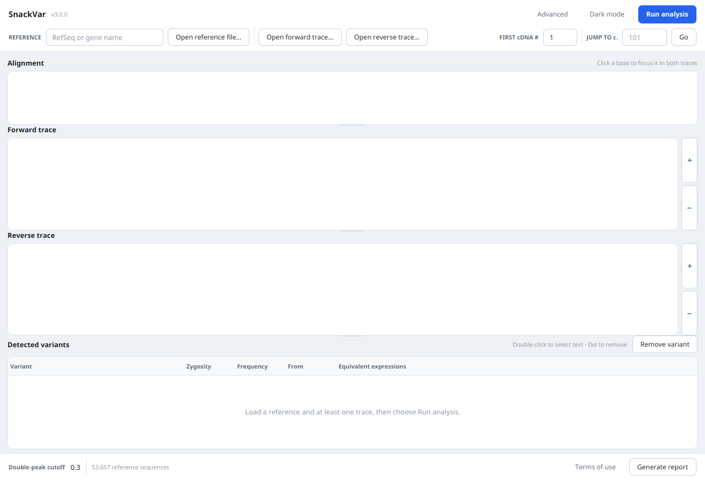

# SnackVar 3.0

Sanger sequencing analysis for clinical use. Reads AB1 chromatograms, aligns
them against a reference transcript, and reports the variants it finds in HGVS
nomenclature — SNVs and indels, homozygous and heterozygous, including the
heterozygous indels that superimpose two alleles onto one trace.

This is a modernised fork of [Young-gon Kim's SnackVar](https://github.com/Young-gonKim/SnackVar).
The analysis is the original author's, published in *J. Mol. Diagn.* 2021. What
changed here is everything around it: the application now builds and runs on
current Java, a long list of latent bugs is fixed, and the interface has been
rebuilt.



## Running it

You need **Java 17 or newer** ([Temurin](https://adoptium.net/temurin/releases/)
is a good choice). You do *not* need to install JavaFX — it ships inside the jar.
Nothing here requires administrator rights.

```sh
git clone <this repo> && cd snackvar-modern
./run.sh
```

On Windows, double-click `run.bat`. Neither script needs Maven installed: they
fall back to the bundled Maven wrapper (`mvnw`), which fetches Maven itself.

### Windows without administrator rights

Every step works from a normal user account.

Each release carries two Windows downloads. Both contain the application **and
a Java runtime** — nothing else needs installing, and neither asks for
elevation.

| | | |
|---|---|---|
| `snackvar-vX-win.zip` | **Recommended.** ~76 MB | Unzip anywhere you can write and run `SnackVar\SnackVar.exe`. Starts instantly. |
| `snackvar-vX-win-portable.exe` | A single file | Self-extracting: unpacks to a temporary folder and launches. One file to copy, but a few seconds slower every start. |

For the single-file build, put reference sequences in
`%USERPROFILE%\.snackvar\reference` — it runs from a temporary folder, so a
`reference` folder beside the `.exe` will not be seen. For the zip, either
location works.

**Or build it yourself.**

1. Download the Temurin **`.zip`** for Windows (not the `.msi`) from
   [adoptium.net](https://adoptium.net/temurin/releases/) and extract it. The
   `.zip` needs no installer.
2. Either set `JAVA_HOME` to the extracted folder, or rename it to `jdk` and
   drop it next to `run.bat` — the script looks there first. It also finds
   per-user installs under `%LOCALAPPDATA%\Programs\Eclipse Adoptium` and
   `%USERPROFILE%\.jdks`.
3. Double-click `run.bat`.

The application only ever writes to your own profile: preferences go to
`HKEY_CURRENT_USER` via the Java Preferences API, and any sequences you add go
to `%USERPROFILE%\.snackvar`. Nothing touches `Program Files`, system-wide
registry keys, or services.

The bundled runtime is trimmed to the modules the application actually uses,
which takes it from about 180 MB to 76 MB. Because a missing module would only
show up at run time, the release build runs the entire test suite against that
trimmed runtime before publishing it.

**Note:** a jar built on Linux will *not* run on Windows — it carries Linux
JavaFX natives. Build the Windows one with:

```sh
mvn -Djavafx.platform=win clean package
```

The `clean` is required when switching platform; see the comment in `pom.xml`.

Once built, the jar carries its own JavaFX runtime and needs nothing else installed:

```sh
java -jar target/snackvar.jar
```

The reference sequences are read from disk rather than packed into the jar, so
if you move `snackvar.jar` somewhere else, put the `reference/` directory beside
it (or point at it with `-Dsnackvar.referenceDir=/path/to/reference`). Run it
from the project and it finds them on its own.

### Reference sequences

The **complete RefSeq set — 53,657 transcripts, 468 MB — is included** in
[`reference/`](reference/). Nothing to download and nothing to configure: type a
RefSeq accession or a gene name into the Reference box and it autocompletes.
You can also open any GenBank or FASTA file directly with **Open reference
file…**.

Because the whole set is committed, a clone of this repository is around half a
gigabyte across 53,657 small files. `git clone` and `git status` are noticeably
slower than for a small repo; a partial clone avoids most of that if you only
want the code:

```sh
git clone --filter=blob:none <repo>     # fetches file contents on demand
```

If `reference/` is ever missing or you want to refresh it against upstream,
[`fetch-reference.sh`](fetch-reference.sh) restores it. It never overwrites
files that are already there.

## Using it

1. Choose a reference — autocomplete a bundled one, or open a GenBank/FASTA file.
2. Open a forward and/or reverse trace (`.ab1`).
3. Confirm the suggested trimming. Getting this right matters for heterozygous
   indels: include as many valid double-peak bases as you can while excluding
   the noise at the ends.
4. **Run analysis**.
5. Click a variant to focus it in the alignment and both chromatograms.
   **Generate report** produces a printable summary.

Parameters under **Advanced** rarely need changing. The one worth knowing about
is the double-peak cutoff: lower it to 0.1–0.2 to pick up somatic variants, at
the cost of more false positives.

## What changed from upstream

### It runs on modern Java again

The headline problem. JavaFX was removed from the JDK in **Java 11**, so on any
current install every `javafx.*` import fails and the application cannot start
at all. Compiling the original source on JDK 21 produces 200-odd
`package javafx.* does not exist` errors before anything else is reached.

- **JavaFX is now a real dependency** (OpenJFX 21 LTS) and is bundled into the
  jar, so `java -jar snackvar.jar` works on a stock JDK.
- **`TooltipDelay` no longer reflects into JavaFX internals.** It used to call
  `setAccessible(true)` on the private `Tooltip.BEHAVIOR` field, which throws
  `InaccessibleObjectException` under the module system unless the app is
  launched with `--add-opens javafx.controls/javafx.scene.control=ALL-UNNAMED`.
  JavaFX 9 added `setShowDelay`/`setShowDuration`, so the hack is gone.
- **A Maven build replaces the Eclipse project** with its four checked-in jars.
  BioJava legacy moves from a vendored 1.9.3 to 1.9.7 from Maven Central.
- **The app no longer depends on its working directory.** `./reference` and
  `Terms_of_use.txt` were resolved against the process CWD, so launching from
  anywhere but the install folder gave an empty reference list and a blank terms
  dialog. Both now resolve relative to the jar.
- **A hardcoded `D:\GoogleDrive\SnackVar\data\test scenario`** was the initial
  file-chooser directory.

### Bugs fixed

Crashes and wrong results, roughly in order of severity:

| | |
|---|---|
| **Infinite recursion in `handleRun`** | On a suspected misalignment the gap-opening penalty escalates and the run retries. Once the penalty reached its 1000 ceiling neither branch changed it, so a trace that still looked misaligned recursed forever — `StackOverflowError`. Now bounded. |
| **Runaway misalignment detection** | `misAlignment()` widened `hetMin`/`hetMax` by 50 on *every* iteration of its inner loop, so with several homozygous indels the heterozygous range grew without bound and matched anything. This is what drove the recursion above. |
| **NPE on a missing reference directory** | `new File("./reference").list()` returns null when the directory is absent, and the result was dereferenced immediately — the main window never opened. |
| **Autocomplete rebuilt the whole match list per keystroke** | It lower-cased the query once per entry and collected every match before showing ten. Across 53,657 references that is a lot of wasted allocation on each key press; it now matches in place and stops at the display limit. It also opened an empty popup when nothing matched. |
| **Homozygous deletions called too long** | The run-length scan re-tested the outer loop's `AlignedPoint` instead of the one being scanned (`ap` where `ap2` was meant), so the run never stopped at a reference gap. Present in both the forward and reverse paths. |
| **`insnull` in HGVS output** | The `Indel` constructor's null guard assigned the *parameter* rather than the field, so `this.indelSeq` stayed null and fed straight into the HGVS string. |
| **Every insertion emitted invalid HGVS** | The deletion, duplication and delins branches strip the `c.` prefix from the second coordinate of a range; the insertion branch did not, producing `c.150_c.151insCCTA` instead of `c.150_151insCCTA`. The three copies of that logic are now one helper. |
| **Insertions were not 3'-normalised, and split across strands** | An insertion slides one base right whenever its first base equals the reference base following it — and the inserted sequence *rotates* when it does, so `c.150_151insGA` and `c.151_152insAG` are the same variant. The equivalence search shifts coordinates while holding the sequence fixed, so it could never find these. HGVS requires the 3'-most form, and because the forward and reverse strands recover different rotations, the two calls never compared equal and one variant was listed **twice** instead of once with a frequency of 2. Insertions are now canonicalised before anything is derived from them, and an insertion that repeats the bases directly before it is reported as a duplication, as HGVS requires. |
| **Heterozygous indels silently discarded** | Three `coordiMap.get(...)` calls unboxed an `Integer` that is null outside the aligned region; the NPE was swallowed by a surrounding catch, so a detected indel just vanished. |
| **Corrupt reference on re-save** | `handleSaveRef` opened the file in *append* mode, so saving the same reference twice produced a FASTA holding two concatenated copies. |
| **Printing ignored Cancel** | `showPrintDialog`'s return value was discarded and every page printed regardless. |
| **Trailing delins group dropped** | `makeHomoDelins` never flushed a group still being accumulated when a pass ended, and leaked `building`/`skipThisTime` state from its first pass into its second. |
| **`GanseqTrace.clone()` was shallow** | The copy shared the original's channel, base-call and quality arrays. |
| **Gene names concatenated** | In `Reference`, `geneName` was declared outside the per-record loop, so a multi-sequence GenBank file merged every gene name into one string that then matched no CDS feature. |
| **`StringIndexOutOfBounds` on short filenames** | `handleOpenRef` took fixed-length substrings from the tail of the filename to sniff the extension. |
| **Several unguarded NPEs** | An aligned point with no cDNA mapping; `format3` when the two alignments disagree on a reference base; `focus2` when the indel starts past the end of the alignment (which also had an off-by-one in its final pane adjustment). |
| **String identity comparison** | `aaChange == ""` compared references, not contents. |
| **Open Reference File was unreachable** | The button was built in `RootController` and then re-parented into the Advanced dialog. A JavaFX node has one parent, so it could only ever appear in the popup. It is now in the toolbar where it belongs. |

Performance, where the original was accidentally quadratic or worse:

- `Indel.getMutatedSeq` built a string one character at a time across the whole
  alignment, and was called once per candidate offset — cubic in alignment
  length, and the dominant cost on long traces.
- `HeteroTrace` accumulated a per-base diagnostic string with `+=` over the
  whole sequence, then threw it away.
- `updateVariantList` rebuilt the reference string character by character for
  every merged variant group.

Housekeeping: APIs deprecated for removal (`new Integer`, `new Double`,
`new Character`) are gone, raw types are parameterised, ~70 `System.out.println`
debug statements and 36 commented-out ones are removed, `printStackTrace` in a
GUI app is replaced with `System.Logger`, and the author's Korean comments —
which document genuinely non-obvious index conventions and calling logic — are
translated to English. The build is warning-clean.

### The interface

The old UI was a single fixed 1258×868 `AnchorPane` with every control pinned to
an absolute coordinate, styled by 40 lines of Verdana CSS. It could not be
resized, and it overflowed any smaller display.

- **Responsive layout.** `BorderPane`/`VBox`/`HBox` with growth constraints, and
  a vertical `SplitPane` so the trace panes and the variant list can be sized
  against each other.
- **Light and dark themes**, toggled from the toolbar and remembered between
  sessions. The palette lives in design tokens (`snackvar-light.css` /
  `snackvar-dark.css`) with all structure in one shared stylesheet.
- **Better chromatograms.** They were drawn onto a 256-colour
  `TYPE_BYTE_INDEXED` surface with no antialiasing, which dithered the curves
  into visible speckle. They are now full RGB with antialiasing and pure stroke
  geometry, and the channel colours follow the theme — trace colours are checked
  against their background for WCAG contrast in both modes by a unit test.
- Quality shading and selection highlighting moved from inline `Background`
  objects to style classes, so they follow the theme too.
- Dialogs size themselves to their content; the old fixed 400×150 popup clipped
  anything longer than a couple of lines.

## Development

```sh
mvn test            # 81 tests
mvn javafx:run      # run from source
mvn package         # build target/snackvar.jar
```

Building for another platform bundles that platform's JavaFX natives. Pass
`clean` as well — maven-shade takes the project artifact as its own input, so
packaging over a jar built for a different platform yields one carrying both:

```sh
mvn -Djavafx.platform=win clean package     # also: mac, mac-aarch64, linux-aarch64
```

`./mvnw` works in place of `mvn` everywhere above and needs no Maven installed.

Pushing a `v*` tag builds a self-contained bundle per platform with `jpackage`
and attaches them to a GitHub release.

### Tests

Upstream shipped no tests and no trace data. The suite here covers the alignment
kernel, the codon table, IUPAC handling, reference parsing, path resolution and
theming — and, most usefully, the analysis end to end.
[`SyntheticTrace`](src/test/java/com/opaleye/snackvar/SyntheticTrace.java)
writes a valid ABI chromatogram from a DNA sequence, which lets
[`VariantCallingPipelineTest`](src/test/java/com/opaleye/snackvar/VariantCallingPipelineTest.java)
run reference-plus-trace through alignment, cDNA numbering and variant calling
and assert on the resulting HGVS — homozygous and heterozygous substitutions,
amino-acid changes, and orientation detection — with no instrument data
required.

`HeteroIndelTest` covers the heterozygous-indel deconvolution, on both strands,
including that the two strands report the same insertion identically — the
condition strand merging depends on.
Rather than string-matching an expected HGVS — which would fail on correct
output, since a variant in a repeat has several valid representations and HGVS
mandates the 3'-most one — it checks calls the other way round: applying the
reported HGVS back to the reference must reproduce the allele that was
sequenced. Every listed equivalent expression is checked the same way.

`FxmlLoadTest` inflates every view with its controller and stylesheets, which
catches a renamed `fx:id` or a broken handler at build time rather than in front
of a user. It skips itself when there is no display.

### Layout

```
src/main/java/com/opaleye/snackvar/
├── MainStage, Launcher      application entry points
├── RootController           main window
├── GanseqTrace, HeteroTrace ABI traces and chromatogram rendering
├── Formatter                alignment → cDNA-numbered columns
├── mmalignment/             Myers–Miller aligner
├── reference/               GenBank and FASTA reading
├── variants/                SNV, Indel, HGVS, calling and filtering
├── report/                  printable report
└── ui/                      theming, dialogs, path resolution
```

`Launcher` exists because a class extending `Application` cannot be the main
class of a jar whose JavaFX lives on the classpath: the launcher checks for the
`javafx.graphics` *module* and aborts with "JavaFX runtime components are
missing" before `main` runs. Going through a plain class skips that check.

## Credits

The analysis, and SnackVar itself, are the work of Young-gon Kim and colleagues:

> Kim YG, Kim MJ, Lee JS, Lee JA, Song JY, Cho SI, Park SS, Seong MW. SnackVar:
> An Open-Source Software for Sanger Sequencing Analysis Optimized for Clinical
> Use. *J Mol Diagn.* 2021;23:140-8.

Sequence handling uses [BioJava legacy](https://github.com/biojava/biojava-legacy).

## Licence

Apache 2.0, as upstream. See [LICENSE](LICENSE) and the
[terms of use](src/main/resources/Terms_of_use.txt) — SnackVar's output requires
interpretation by a qualified expert and the developers accept no responsibility
for decisions based on it.
